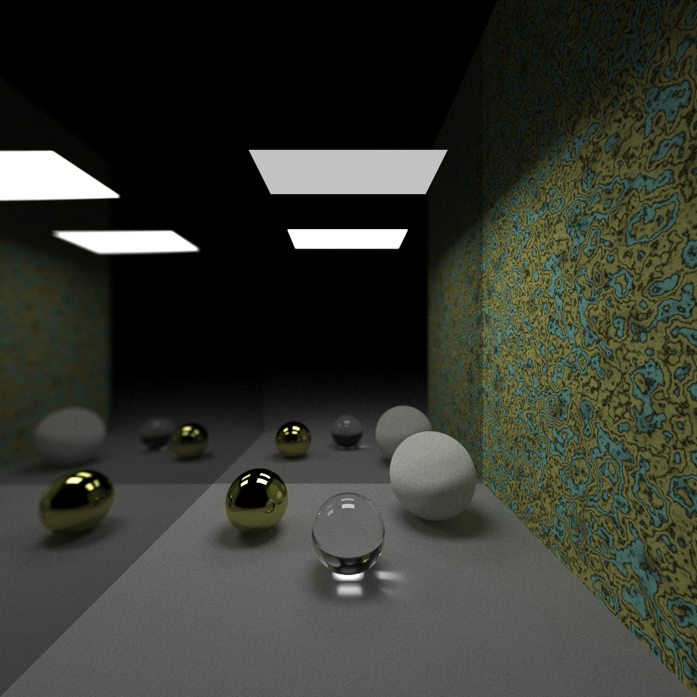
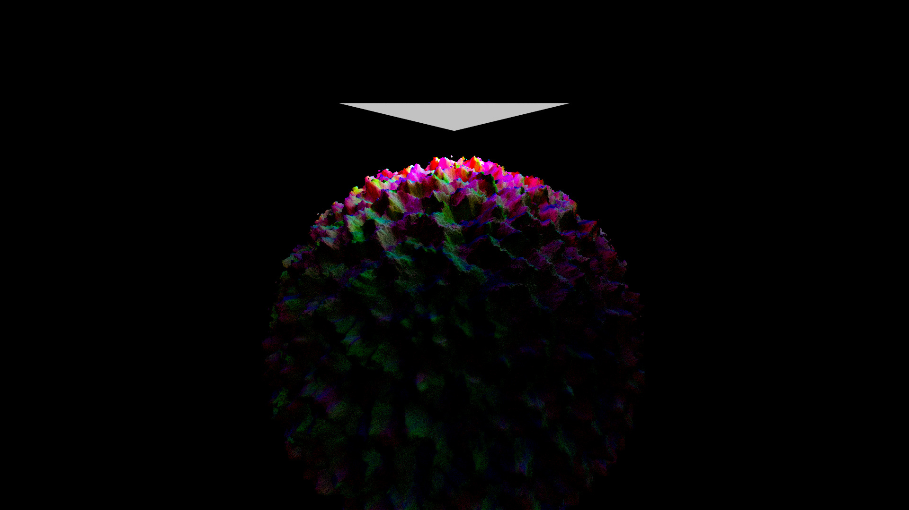
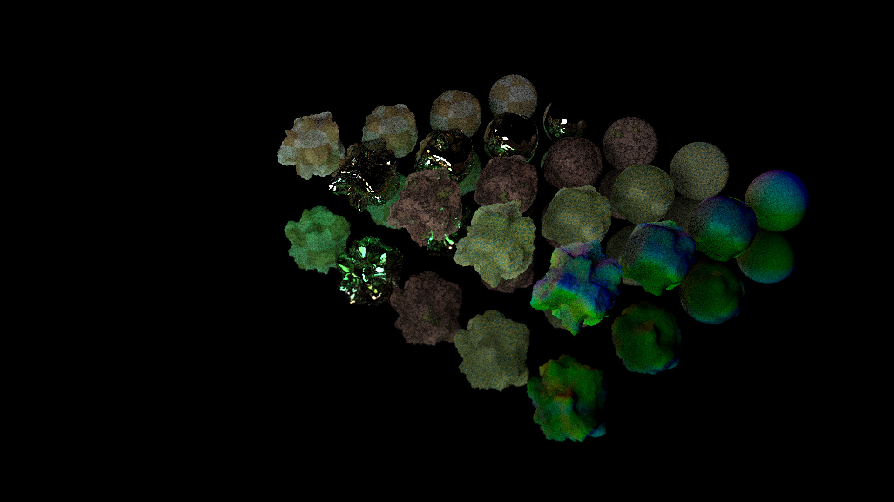
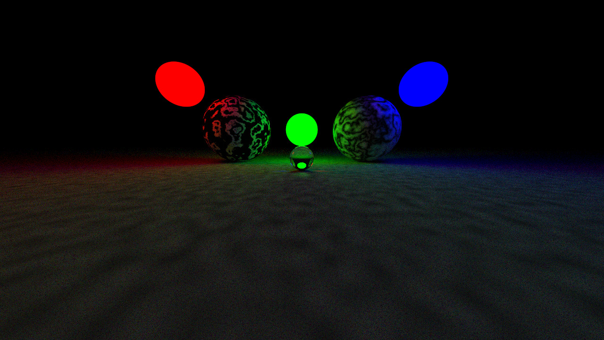
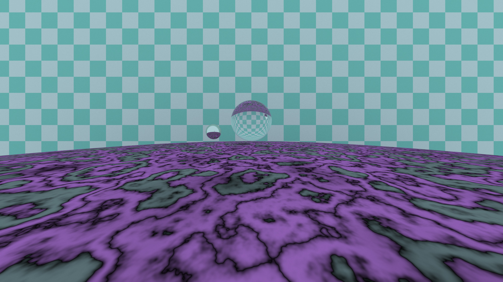
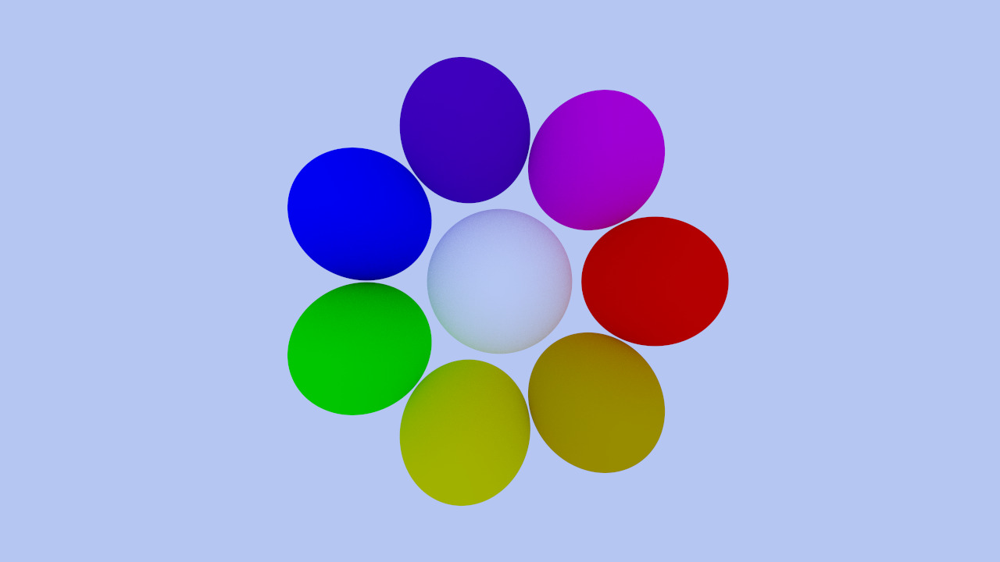

C Ray Tracer
--
A minimal raytracer written in C.  
This is largely inspired by Peter Shirley's _Ray Tracing in One Weekend_, but it uses C rather than C++.  

This project will help me practice C, architecture, graphics programming principles, and math.  

Usage
---
Written on Manjaro Linux and I have not tested other distros.  
To compile:  
`cd src/`  
`source build.sh`  
build.sh compiles the program using gcc.  
the executable, crt.exe will be in craytracer/build/  

| Command Line Argument | Description | Default |
--- | --- | ---
| -o, --output=FILE            | Path where render is stored. Accepts .jpg, .png, .ppm, .bmp | N/A |
| -j, --jpeg_quality=QUALITY   | Int from [1, 100] that determines quality of jpg output. (1 has really bad artifacts) | 100 |
| -w, --width=WIDTH            | Width of output image in pixels. | 720 |
| -h, --height=HEIGHT          | Height of output image in pixels. | width * 9/16  |
| -f, --vfov=VFOV              | Float that sets vertical field of view. Smaller values are more zoomed in. | 60.0 |
| -c, --scene=SCENE            | Which scene to generate -- SCENE is an integer correspoinding to a switch in scene.h | -1 |
| -n, --num-samples=N_SAMPLES  | Use (integer) N_SAMPLES for each pixel | 10 |
| -d, --max-depth=MAX_DEPTH    | MAX_DEPTH is the number of times a ray can be reflected | 10 |
| -t, --thread-count=N_THREADS | Number of threads to use. | 4 |
| -b, --job-count=N_JOBS | Number of jobs to create when rendering. Jobs are delegated to threads by a threadpool. More jobs means expensive parts of the image can be split up and rendered by threads that finish faster jobs early. | 12 |
| -s, --seed=SEED              | Seed to pass to stdlib.h srand(). | Uses current time as seed |
| -?, --help                   | Give this help list |
| --usage                      | Give a short usage message |

How is this different from _Ray Tracing in One Weekend_?
---
- Multithreading
  - used pthread to speed up render times
  - implemented a threadpool structure which makes it easy to add arbitrary threads
- Better Noise
  - Implemented simplex noise which is a newer and better version of perlin noise.
  - Imlemented fractional brownian motion
  - Analaytical derivatives of noise functions
- FBM Sphere
  - warp spheres with simplex noise so they look like planets.
- Command-line Arguments (see: Usage)
  - don't have to compile the program to change little details  
- Save your render to .jpg, .png, .bmp, as well as .ppm  
- Triangles
- New Textures
- The biggest difference is that this does not have C++ features like classes, templates, function overloading, or any C++ libraries.  
  - Some of these features are sorely missed, like function overloading, but that's the reason I made this project.  
  - Manual memory management

Plans
---
- Display renders in window using SDL
  - View renders in progress
  - Decide whether a render is worth saving before
- Implement meshes
- Bounding hierarchies
- Load scenes from a file
