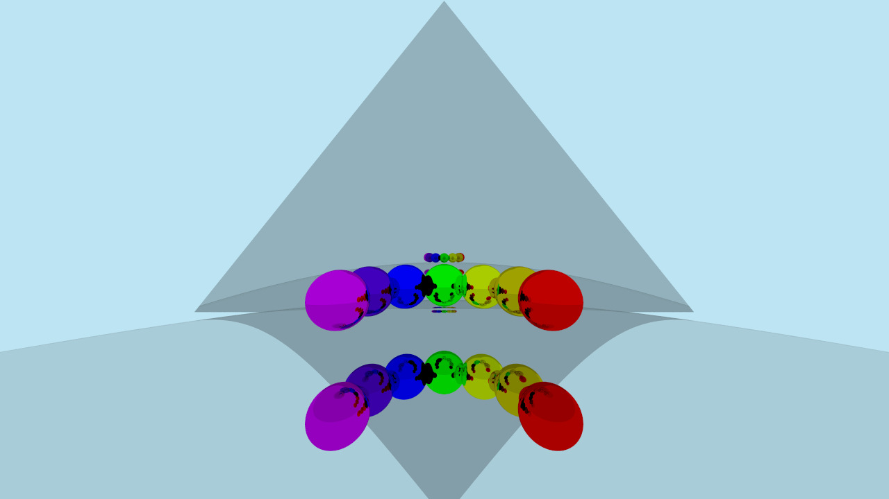

C Ray Tracer
--
A minimal raytracer written in C.  
This is largely inspired by Peter Shirley's _Ray Tracing in One Weekend_, but it uses C rather than C++.  

This project will help me practice C, architecture, graphics programming principles, and math.  

Usage
---
Written on Manjaro Linux and I have not tested other distros.  
To compile:  
`cd src/`  
`source build.sh`  
build.sh compiles the program using gcc.  
the executable, crt.exe will be in craytracer/build/  

| Command Line Argument | Description | Default |
--- | --- | ---
| -o, --output=FILE          | Path where render is stored. Accepts .jpg, .png, .ppm, .bmp | N/A |
| -j, --jpeg_quality=QUALITY | Int from [1, 100] that determines quality of jpg output. (1 has really bad artifacts) | 100 |
| -w, --width=WIDTH          | Width of output image in pixels. | 720 |
| -h, --height=HEIGHT        | Height of output image in pixels. | width * 9/16  |
| -n, --num-samples=N_SAMPLES  | Use (integer) N_SAMPLES for each pixel | 10 |
| -s, --seed=SEED              | Seed to pass to stdlib.h srand(). | Uses current time as seed|
| -?, --help                   | Give this help list |
| --usage                  | Give a short usage message |

How is this different from _Ray Tracing in One Weekend_?
---
- I have implemented triangle intersection.  
- I have implemented some textures on my own, such as "perlin_sincos_texture". I enjoy playing around with noise and math to make interesting textures.
- The biggest difference is that this does not have C++ features like classes, templates, function overloading, or any C++ libraries.  
  - Some of these features are sorely missed, like function overloading, but that's the reason I made this project.  
  - For example, Shirley uses smart pointers in his code for creating objects, textures, and materials. My alternative can be seen in memory.h, it's a simple struct that allocates some amount of memory and then lets you copy data to it and returns a pointer to that data. It's pretty crude but so far it has worked well. Then you can just call FreeMemoryRegion() before the program terminates.

